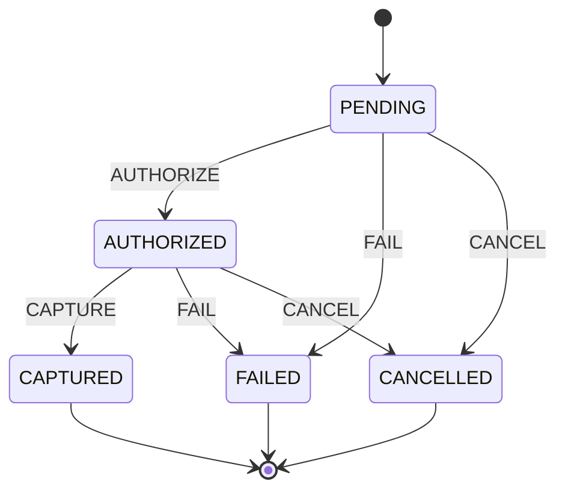

# Finite State Machine

Un ejemplo pequeño para explicar como modelar un dominio con una **máquina de estados finita (FSM)** explícita.
Para este caso, el ciclo de vida de un pago, donde pueden suceder transiciones ilegales y esto es un riesgo de negocio real.

En la práctica, el dominio impone reglas simples: no puedes capturar un pago que nunca se autorizó, ni cancelar uno que ya quedó liquidado. La máquina de estados las centraliza en un solo lugar, en lugar de ir repitiendo `if` por el código.

## Dos implementaciones

El mismo modelo está resuelto en dos lenguajes para poder comparar cómo se expresa la misma FSM en cada uno:

- **`typescript/`** — TypeScript, tests con Jest.
- **`java/`** — Java, tests con JUnit 5 sobre Maven.

Ambas comparten los mismos estados, eventos y tabla de transiciones, así que el diagrama de abajo aplica a las dos.

## El modelo



`CAPTURED`, `FAILED` y `CANCELLED` son estados terminales: no aceptan más eventos. Cualquier evento que no aparezca como flecha saliente de un estado es una transición ilegal y la máquina la rechaza (lanza un error / excepción en lugar de cambiar de estado).

## Estructura

```
typescript/
  src/domain/payment/
    PaymentState.ts          # los estados
    PaymentEvent.ts          # los eventos
    PaymentStateMachine.ts   # tabla de transiciones + máquina
    Payment.ts               # agregado
  tests/
    PaymentStateMachine.test.ts
    Payment.test.ts

java/
  src/main/java/com/jcoppede/fsm/payment/
    PaymentState.java              # los estados
    PaymentEvent.java              # los eventos
    PaymentStateMachine.java       # tabla de transiciones + máquina
    Payment.java                   # agregado
    IllegalTransitionException.java
  src/test/java/com/jcoppede/fsm/payment/
    PaymentStateMachineTest.java
    PaymentTest.java
```

## Primeros pasos

### TypeScript

```bash
cd typescript
pnpm install
pnpm test
```

### Java

```bash
cd java
mvn test
```
